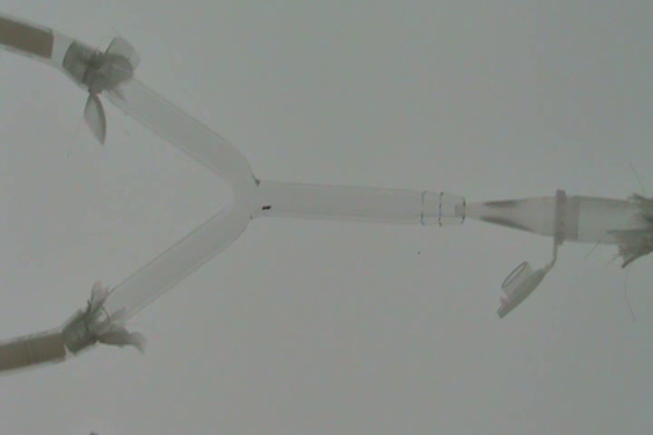
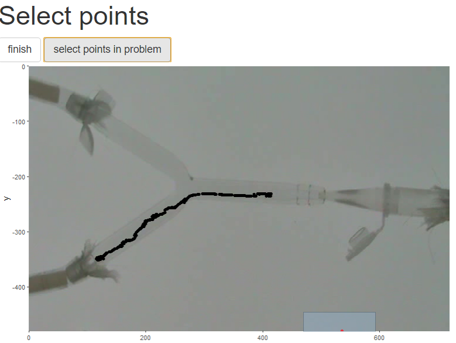
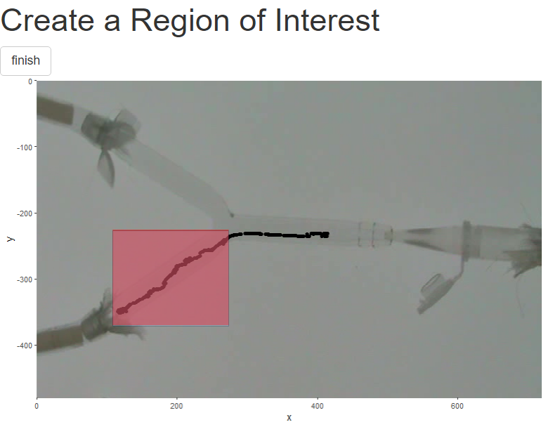
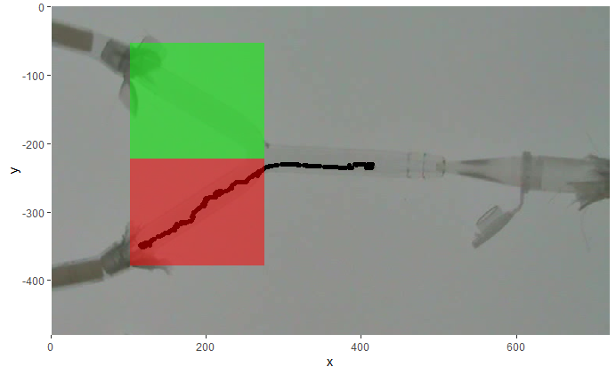

# trackJR

*Using Julia language and R for tracking tiny insects: an analysis of microhymenoptera wasps and olfactometers responses.*

This package allow working and tracking tiny insect responses. Also, as use [Julia](https://julialang.org), it allow "meeting the velocity" and could be very helpful for batch processing. Also, many functions of the packages has [shiny](https://shiny.rstudio.com/) elements to help users. 

We develop this package for [R](https://cran.r-project.org/) because (we love R! and) most analyzes in ecological studies are in R environment. R is a more "mature" language than Julia. Although, as is expect for other languages, such as [Phyton](), Julia would be the place were newly ecological advances stay.

`TrackJR`is inspired in the R package [pathtrackr](https://aharmer.github.io/pathtrackr/) and a solution to work with tiny insect and was developed with the batch processing in mind. The main functions for tracking are in `Julia` language and used in R by [JuliaCall](https://cran.r-project.org/package=JuliaCall) package. These function are common from images processing and based on `convolve` with a kernel filter and take the `edgeness` of an image ([MIT Course](https://computationalthinking.mit.edu/Fall20/)).



## How to use *trackJR*

### Pre-installing *trackJR*
1) *trackJR* package require [julia](https://julialang.org) to be installed on your machine.
2) *trackJR* package require [FFmpeg](https://ffmpeg.org) to be installed on your machine, which R calls via the *system()* function as well as [pathtrackr](https://aharmer.github.io/pathtrackr/). These links provide instructions for download and allow to use it: [Install FFmpeg on Windows](http://www.wikihow.com/Install-FFmpeg-on-Windows)

### installing *trackJR*

To install *trackJR* directly within R using the *install\_github()* function from the [devtools](https://www.rstudio.com/products/rpackages/devtools/) package:

``` r
devtools::install_github("Gdlv/trackJR")
```
### start using *trackJR*!
After installing the package you need to load *trackJR*. 

``` r
library(trackJR)
```
As you can see in the R console, there are few points to remember. *see troubleshooting points*.
The first step to start using the package is to tell R where is Julia binary file. After that, you could just start using and load [Julia]() functions by `firstJulia` function. This function initialize the connection between [Julia]() and [R]() and write the image processing functions. This step, also install packages for Julia if they are not installed, so it could take few minutes. 

``` r
options(JULIA_HOME = "the folder that contains julia binary")
firstJulia()
```
## 1) Take the data! 
Now we can use the `trackJR` function. This function use three arguments, the path to video file to track the insect, the frame per seconds you want and the time to stop tracking. The output is a `data.frame` with three column (frame, X and Y). 
``` r
vid<-"C:/Users/video001.mp4" 
dataT<-trackJR(vid,timestop="00:02:00")
```
## 2) Explore and plot the data!
You can use a set of functions to manage and analyze the tracked insect path. You could solve some points in troubles (if there are). So, graphical explore the points in a ggplot plot. The `trackJR_ggplot` function use the first frame of your video to plot the data. If the data is explored, you can find that the *Y-axes* is negative. The video tracking set (0,0) coordinates at left-top. 

``` r
graf<-trackJR_ggplot(mypathDirandFile,dataT)
graf
``` 


You can clean the points with the function `trackJR_clean`. Select the points (or region of interest, you can select multiples regions) to solve, in a conservative way, the coordinates of the points. This solution put the previous points to "points_in_problem'. Also it create an object to understand which points had been corrected.
``` r
newData<-trackJR_clean(graf)
graf2<-trackJR_ggplot(mypathDirandFile,newData)
``` 


## 3) Analyze the data!

Analyze your data creating box or region of interest with the `trackJR_box` function. Use the function to create boxes where you want, such as "bottom arm" or "upper arm" of an Y-olfactometer.
``` r
trackJR_box(graf2,"box1")
``` 


You can plot the boxes with 'geom_rect()' function from 'ggplot2'package. 
``` r
graf2 + geom_rect(data = box1,mapping=aes(x=NULL,y=NULL,xmax=xmax,ymax=ymax,xmin=xmin,ymin=ymin),fill="red",alpha=0.5)+
        geom_rect(data = box2,mapping=aes(x=NULL,y=NULL,xmax=xmax,ymax=ymax,xmin=xmin,ymin=ymin),fill="green",alpha=0.5)
```


Subset the main tracked data frame with the boxes you had created.
``` r
estimuli<-trackJR_pbox(newData,box1)
control<-trackJR_pbox(newData,box2)
``` 

## Work in Batch mode!
We wrote some function to help the batch working. If you have a dir with video files, you would use the `trackJR_Batch` function for batch processing and take the output as `list` object. This `list` have the video name with the three column (frame, X and Y). Be careful to write the path to the directory without last bar (`/`)
``` r
vidDir<-"C:/Users/the50videos" 
dataDir<-trackJR_Batch(vidDir,timestop="00:02:00")
```
Also, you could add the ggplot for each tracking to the list with the `trackJR_Batch_ggplot` function. You can inspect which video has points in problem and solve them with `trackJR_clean`. Here is an example to modify few points of one video from a list. 
``` r
vidDir<-"C:/Users/the10videos" 
trackdata<-trackJR_Batch(vidDir,timestop="00:02:00")
trackdata2<-trackJR_Batch_ggplot(vidDir,trackdata)
trackdata2[[2]]$graf #Now it has the ggplot as an element.
```
If you solve the points in problems you should overwrite the `dataTrackJR` elements of your batch list.

``` r
trackdata2[[7]]$graf
trackdata2[[7]]$dataTrackJR<-trackJR_clean(trackdata2[[7]]$graf)

```
Sometimes the record is not similar between trails. If you plot all the points with "Video1" as background, some tracked has to be corrected. For this trackdata you can add reference points and correct them with the `trackJR_correctXY`function. first use the `trackJR_refpoint`to create an "refpoint" object in your workspace and run a simple loop to add each reference point to your `list`.

```r
trackJR_refpoint(trackdata2)

for(i in 1:length(trackdata2)){
   trackdata2[[i]]$refpoint<-get(ls()[ls()==paste("refpoint",i,sep="")])
   }

tablaD<-data.frame(vid=character(),x=numeric(),y=numeric())

for(i in 1: length(trackdata2)){
  tablaD[i,1]<-do.call("rbind",al2[[i]][1])
  tablaD[i,2:3]<-do.call("cbind",al2[[i]]$refpoint)
}

trackdata2[[1]]$graf + geom_point(data=tablaD,aes(x=x,y=y),col=2)

```
Then, you can correct the `trackJR_data` of particular tracked data in your list.

```r
trackdata2[[7]]<-trackJR_correctXY(trackdata2[[7]],Refpoint = trackdata2[[1]]$refpoint)

```
In the same way you create boxes and subsets for your `dataTrackJR` data.frame, you could use the `trackJR_summ` function to summary your `list`.  

```
summaryData<-data.frame()

for( i in 1:length(al2)){
  summaryData[i,]<- trackJR_summ (al2[[i]]$dataTrackJR,list(box1,box2,box3),list("estimuli","control","blank"))
  
}
summaryData
```
Now you have the points from all `dataTrackJR` from your `list` inside each box.
## Troubleshooting and Ways to Get Help

#### Error: Julia is not found

Make sure the `Julia` installation is correct.
`JuliaCall` can find `Julia` on PATH,
and there are three ways for `JuliaCall` to find `Julia` not on PATH.

- Use `julia_setup(JULIA_HOME = "the folder that contains julia binary")`
- Use `options(JULIA_HOME = "the folder that contains julia binary")`
- Set `JULIA_HOME` in command line environment.

#### Error: "could not load libdSFMT.dll"
The cause for the problem is that R cannot find the libdSFMT.dll library needed by `Julia`.
add a line in your script:
`dyn.load("the folder that contains julia binary/bin/libdSFMT.dll")`
