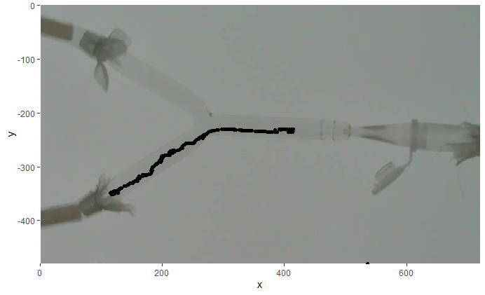

# trackJR

*Using Julia language and R for tracking tiny insects: an analysis of microhymenoptera wasps and olfactometers responses.*

This package allow working and tracking tiny insect responses and is inspired in [pathtrackr](https://aharmer.github.io/pathtrackr/) and a solution to work with tiny insect. Also, as use [Julia](https://julialang.org), it allow "meeting the velocity" and could be very helpful for batch processing.

We develop this package for [R](https://cran.r-project.org/) because (we love R! and) most analyzes in ecological studies are in R enviroment. R is a more "mature" language than Julia. Although, as is expect for other lenguages, such as [Phyton], Julia would be the place were newly ecological advances stay.

The main functions for tracking are in `Julia` language and used in R by [JuliaCall](https://cran.r-project.org/package=JuliaCall). These function are common from images processing and based on `convolve` with a kernel filter and take the `edgeness` of an image ([MIT Course](https://computationalthinking.mit.edu/Fall20/)).


## How to use *trackJR*

### Pre-installing *trackJR*
1) Install [julia](https://julialang.org)
2) *trackJR* package require [FFmpeg](https://ffmpeg.org) to be installed on your machine, which R calls via the *system()* function as well as [pathtrackr](https://aharmer.github.io/pathtrackr/). These links provide instructions for download and allow to use it: [Install FFmpeg on Windows](http://www.wikihow.com/Install-FFmpeg-on-Windows)

### installing *trackJR*

To install *trackJR* directly within R using the *install\_github()* function from the [devtools](https://www.rstudio.com/products/rpackages/devtools/) package:

``` r
devtools::install_github("Gdlv/trackJR")
```
### start using *trackJR*!
After installing the package you need to load *trackJR*. 

``` r
Library(trackJR)
```
As you can see in the R console, there are few points to remember. *see troubleshoting points*.
The first step to start using the package is to tell R where is Julia binary file. After that, you could just start using and load [Julia] functions by *firstJulia* function. This function initalize the conection between [Julia] and [R] and write the image proccesing functions. This step, also install packages for Julia, so it could take few minutes. 
``` r
options(JULIA_HOME = "the folder that contains julia binary")
firstJulia()
```
1) Now we can use the *trackJR* function. This function use three arguments, the path to video file to track the insect, the frame per seconds you want and the time to stop tracking. The output is a `data.frame` with three column (frame, X and Y). 
``` r
vid<-"C:/Users/video001.mp4" 
dataT<-trackJR(vid,timestop="00:02:00")
```
Also, if you have a dir with video files, you would use the *trackJR_Batch* function for batch processing and take the output as `list` object. This `list` have the video name with the three column (frame, X and Y). Be careful to write the path to the directory without last bar (`/`)
``` r
vidDir<-"C:/Users/the50videos" 
dataDir<-trackJR_Batch(vidDir,timestop="00:02:00")
```
2) You can use a set of function to work and analize the tracked insect path. First you should solve some points in troubles (if they are). So, graphical explore the points in a ggplot plot.

``` r
graf<-trackJR_ggplot(mypathDirandFile,dataT)
graf
``` 


You can clean the points with the funtcion 'trackJR_clean'. Select the points (or region of interest) to solve, in a conservative way, the coordinates of the points. This solution put the previous points to "points_in_problem'. Also it create an object to understand which points had been corrected.
``` r
newData<-trackJR_clean(graf)
graf2<-trackJR_ggplot(mypathDirandFile,newData)
``` 


3) Analize your data creating box or region of interest with the 'trackJR_box'function. Use the function to create boxes where you want, such as "bottom arm" or "upper arm" of an Y-olfactometer.
``` r
trackJR_box(graf2,"box1")
``` 


You can plot the boxes with 'geom_rect()' function from 'ggplot2'package. 
``` r
graf2 + geom_rect(data = box1,mapping=aes(x=NULL,y=NULL,xmax=xmax,ymax=ymax,xmin=xmin,ymin=ymin),fill="red",alpha=0.5)+
        geom_rect(data = box2,mapping=aes(x=NULL,y=NULL,xmax=xmax,ymax=ymax,xmin=xmin,ymin=ymin),fill="green",alpha=0.5)
```


4) Subset the main tracked data frame with the boxes you had created.
``` r
estimuli<-trackJR_pbox(newData,box1)
control<-trackJR_pbox(newData,box2)
``` 


## Troubleshooting and Ways to Get Help

#### Error: Julia is not found

Make sure the `Julia` installation is correct.
`JuliaCall` can find `Julia` on PATH,
and there are three ways for `JuliaCall` to find `Julia` not on PATH.

- Use `julia_setup(JULIA_HOME = "the folder that contains julia binary")`
- Use `options(JULIA_HOME = "the folder that contains julia binary")`
- Set `JULIA_HOME` in command line environment.

#### Error: "could not load libdSFMT.dll"
The cause for the problem is that R cannot find the libdSFMT.dll library needed by `Julia`.
add a line in your script:
`dyn.load("the folder that contains julia binary/bin/libdSFMT.dll")`
